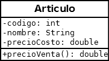

##  FORMULARIO ARTICULO

 Descargue la carpeta Practico5_Articulo, descomprimala y dejela en su carpeta Workspace de eclipse (recuerde que tiene que importar desde eclipse la carpeta que le queda adentro con el mismo nombre)

 Codificar el FrmArticulo que se encuentra en el paquete grafica para poder cargar los atributos de un Articulo (codigo, nombre, precioCosto) en campos de texto y en un 4to campo de texto visualizar el precio de Venta utilizando el método precioVenta.
 
 Recuerde que a la clase Articulo del paquete logica le corresponde el siguiente Diagrama de clases:

 

 Una vez resuelto el ejercicio, borre la carpeta Practico5_Articulo (la que está aquí) y suba su proyecto (el que tiene en Workspace de eclipse)
